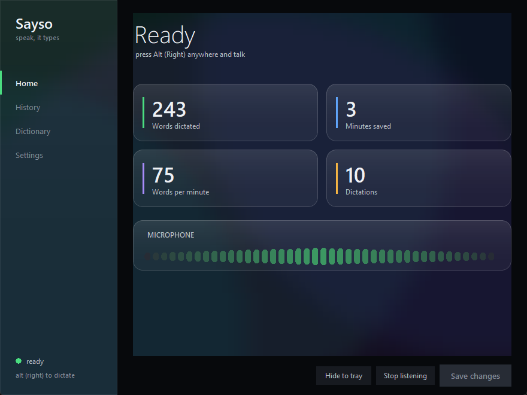

# Sayso

Local voice dictation for Windows. Press a key, speak, press it again, and what
you said is typed into whatever you had focused — your editor, your browser,
your chat window, anything.

It runs entirely on your own machine. No account, no subscription, no API key,
and no audio ever leaves the computer.



## What makes it different

**It types what you actually said.** There is no "clean it up with an LLM" pass,
because a reworded instruction is a wrong instruction when you are dictating
into a terminal or a code editor. Whisper supplies the punctuation and the
capitals; the words stay yours.

**It learns your words, not the internet's.** Whisper already knows English.
What it fumbles is proper nouns: your clients, your street, your product names.
Put them in the Dictionary and they are fed to the model as hints *before* it
decides, which fixes the problem at the source instead of find-and-replacing
the output.

## Requirements

- Windows 10 or 11
- An NVIDIA GPU is strongly recommended. `large-v3` needs about 3.1 GB of VRAM
  and transcribes 6 seconds of speech in under a second on an RTX 3060 Ti.
  Without a GPU it falls back to CPU automatically and is slow but works.
- About 3 GB of disk for the model, downloaded once on first run.
- [uv](https://docs.astral.sh/uv/) for the Python environment.

## Set it up with Claude Code or Codex

Paste this into Claude Code or Codex from the folder you want it in:

```
Set up Sayso, a local Windows dictation app, from
https://github.com/YourFutureSiteDev/sayso

1. Clone it, then run `uv sync` in the repo root.
2. Run `uv run python -m sayso --devices` and show me the microphone list so I
   can pick mine.
3. Run `uv run python -m sayso --self-test`. It downloads the Whisper model
   (about 3 GB, once) and checks the microphone, the GPU, transcription
   accuracy and the typing path. Show me the word error rate it reports.
4. If that passes, run `build.cmd` to produce dist\Sayso\Sayso.exe, and tell me
   where it landed.

Read README.md and docs/ARCHITECTURE.md first. Do not change the verbatim
behaviour: this app deliberately does not rewrite what I say.
```

### Or by hand

```bash
git clone https://github.com/YourFutureSiteDev/sayso
cd sayso
uv sync
uv run python -m sayso            # the window
```

`build.cmd` produces a standalone `dist\Sayso\Sayso.exe` you can pin to the
taskbar.

## Using it

1. **Press Right Alt.** A small bar appears at the bottom of the screen.
2. **Speak.** The waveform follows your voice.
3. **Press Right Alt again**, or click the tick, and the words are typed where
   you were typing. The cross throws it away.

Holding the key works too: it ends when you let go.

| Command | What it does |
|---|---|
| `uv run python -m sayso` | The window |
| `... --devices` | List microphones with their indexes |
| `... --self-test` | Check the model, accuracy and typing end to end |
| `... --file speech.wav` | Transcribe a file and print it |
| `... --tray` | Tray icon only, no window |
| `... --console` | No window, no tray, logs to the terminal |

## Making it hear you better

In order of how much difference it makes:

1. **Pick the right microphone.** Settings → Microphone. This costs more
   accuracy than every other setting combined.
2. **Add your words** to the Dictionary: names, clients, streets, products.
3. **Add corrections** for the handful it still spells wrong, as
   `what it hears = what you meant`. Spaces and hyphens are interchangeable,
   so one line catches every spelling.
4. Drop to `large-v3-turbo` only if you need the speed — it is roughly four
   times faster and about a point less accurate.

Settings and history live in `%LOCALAPPDATA%\Sayso`, deliberately outside the
install folder so rebuilding cannot wipe them.

## Privacy

Everything is local. The model runs on your machine, the history is a plain
file on your disk, and there is no network call anywhere in the app except the
one-off model download from Hugging Face on first run. Clear the history
whenever you like from the History tab.

## Licence

MIT. See [LICENSE](LICENSE).
